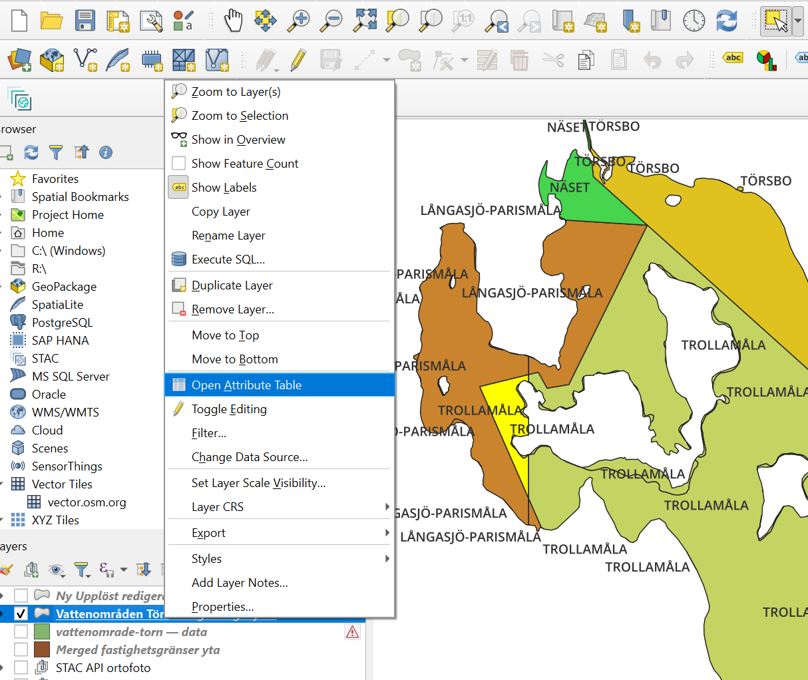
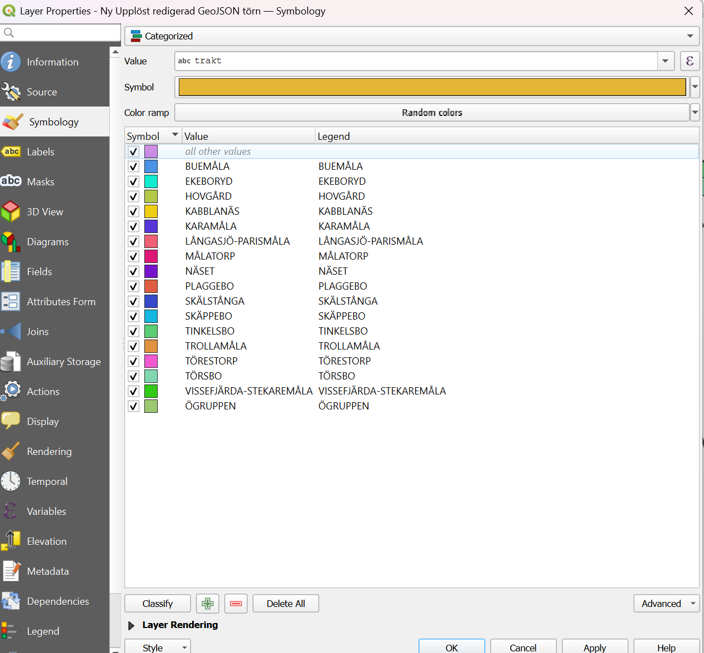
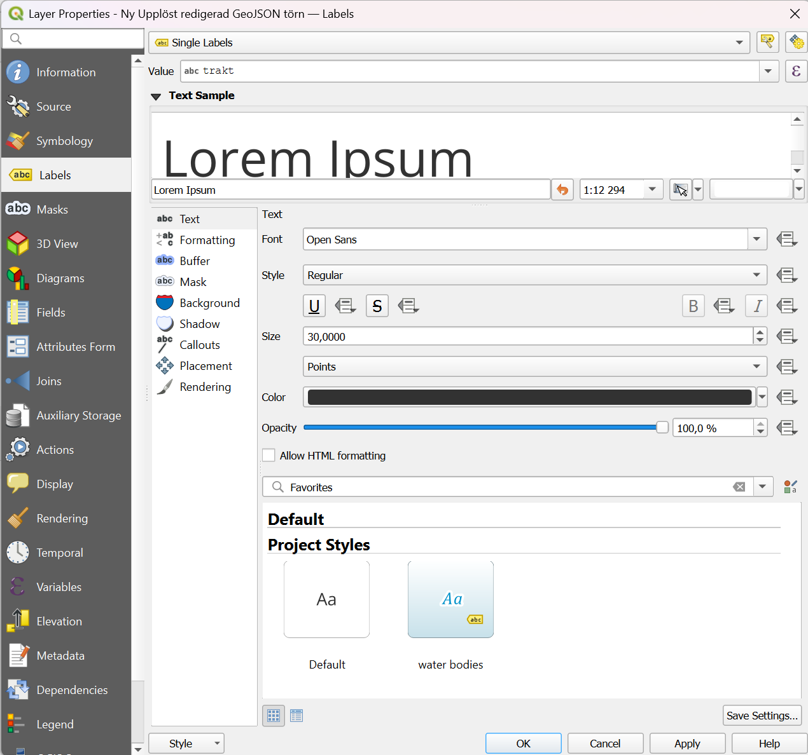

# Skapa vattenområdeskarta över en sjö / Create a map over water areas in a lake.

Nedan kan du följa mitt projekt med att skapa en vattenområdeskarta till sjön törn för både vattenägare för vattenområdesföreningen Törn och Törngöls FVOF och för fiskekortsköpare igenom iFiske för val om vattenområden rapporterna av fisk för att få historik på var i sjön fisken tas upp. Projektet började i februari 2025 då lantmäteriet äntligen gjorde sin data tillgänglig kostnadsfritt igenom Värdefulla datamängder direktivet.

Mitt mål med denna text är att dokumentera hur jag gjorde för att jag själv ska kunna producera flera kartor samt att andra människor och föreningar kanske kan ta del och göra sina egna kartor med riktig data i fina format som geo-format samt vektorkartor för mer högupplösta kartor utan artefakter samt låg dataförbrukning tills sjöss.

Mitt mål i framtiden med rådatan är att i ett bra format kunna använda Maplibre GL JS för att visa vattenområden igenom kod, du kan klicka på områden och igenom webbläsaren få en position av fiskaren för att säga till i vilket vattenområde denna befinner sig, detta för att hjälpa fiskare att orientera sig utan landmärken som holmar ocj öar som finns på kartan för att snabbare ge informationen denna söker.

Först behöver du begära ut produkterna:
- topografi 10 vektor. 
- Fastighetsindelning vektor (krävs mer handläggsningstid för att ) för byagränserna

Ifrån Lantmäteriet. Notera att du alltid måste följa licensvilkoren trots att du fått godkänt på din ändamålsprövning.

Jag ansökte hos lantmäteriet och fick tillgång till live-tjänsten topografi 10. Lantmäteriet har en bra guide på hur man får in topografi 10 i QGIS, länk:
Jag kommer använda mig av 2 komponenter i detta projekt ifrån dessa datamängder.
- Dels sjögeometrin i lagret gruppen´´´Mark´´ lagret "Sjö" och "Vattendragsyta" ur topografi 10 vektor.
- Dels de dels outredda byarnas gränser som går i sjöarna ifrån fastighetsindelningsprodukten.

### Ladda ner och sätt upp QGIS.
Det jag gjorde sedan var att jag laddade ner QGIS. Det är en rätt så brant inlärningskurva för QGIS men tillslut lyckades jag lära mig hur jag använde det. Skapa en mapp lokalt på din dator där du lägger projektet och alla tillhörande filer. Ställ in QGIS på engelska då det ör enklare att hitta svar på engelska forum. QGIS har två lägen. En där du skapar kartan och en där du förbereder kartan för export, lägger till skalor etc, färger, etiketter etc, Huvudvyn när du öppnar den är den första och den andra heter Layots. Följ instruktionerna på Lantmäteriets hemsida för att hämta hem topografi 10 och sätt upp det i QGIS som ett eget lager.

## Gör om geopackage till GEOJSON.
Om detta steg är nödvändigt vet jag ej, men jag gjorde det iallafall.

Då fastighetsindelning hämtas hem ifrån STAC API´t i rutor kan det vara så att din sjös fastighetsgränser sträcker sig över flera rutor. Du får då sammanfoga lagren som du plockar ut för att få ett enhetligt lager du sedan kan köra intersection med sjöpolygonen sedan.

## Använda Vector > Geoprocessing Tools > Intersection för att sortera ut de fastighetsindelningar inom sjöpolygonen.
För mig tog det lite för lång tid att inse att du kan välja en feature i QGIS med muspilen men detta är inte samma sak som "Select Feature"
Se till att namge de nya lager som detta verktyg skapar då detta är temporärt (dvs om du stänger ner QGIS kommer det inte sparas)

## Städa bland vattenområden som inte finns, dubletter etc.
Du kan nu se att vi bara har de områden vi är intresserade av.

^^Tex här finns det en "trakt" fastighetsgräns som heter ögrupp som tillhör vattenområdet trollamåla enligt vår förening, jag tar då och Select Features by Area or single click, och högerklickar sedan på lagret när jag valt detta. Jag klickar sedan Open Attribute table efter att jag togglat editing. Då är den feature jag selectat blåmarkerad i Attribut tabellen och kan då ändra "trakt" i detta fall. 

^^ Bikd över select feature och open attribute table. 

Då GeoJSON kan redigeras i QGIS döpar jag helt enkelt om "trakt" fältet på polygonen till de jag vill att de ska uppgå i en annan.
Jag använder mig sedan av editknappen i QGIS efter att jag Select en feature jag vill byta namnet på. En tabell öppnas och jag kan redigera fälten, "trakt" i mitt fall då. 

## Lös upp vattenområden med samma namn med Vector > Geoprocessing Tools > Dissolve
Då många vattenområden har samma namn nu och färg om du gjort rätt innan kan du då använda
 
^^Innan disolve

## Lägg labels. färger etc(styles) på datan.
Det smidiga med vektordata är att den faktiskt innehåller informationen vi vill visa. Så tex vattenområdena som är byanamnen i mitt fall ligger under feature "trakt" som lantmäteriet gjort. Du kan då använda QGIS för att på denna ruta automatiskt färglägga polygonerna i färger som inte samma bredvid varandra, generera en palett. Och placera ut text automatiskt på polygonernas geometriska mitt. Inga mer manuellt utplacerade texter som man måste lägga tid på att style:a! Det går även att kopiera styles mellan lager. För att färglägga områden baserad på en attribut som i vårt fall är trakt högerklickar du på lagret och klickar på properties. Efter det går du till symbology samt väljer Categorized. Välj Value Trakt eller vad du nu väljer och klickar på random colors. 

Likaså på label.

Tips är att du kan göra detta steget tidigare i processen så ser du skillnad på småpolygoner innan du gjort Dissolve etc.

##  Förbered kartan för export till svg eller annat format.
QGIS Slutligen tog jag upp "layouts" i QGIS Project-meny för att exportera kartan i .svg format för att visa på hemsidan. Du kan även exportera som PDF men jag tycker det är dåligt att exportera till ett rasterformat när vi nu har fin vektordata. Jag lyckades aldrig att exportera kartan i en tillräckligt bra skala så att man kunde urskilja holmarna och samtidigt texten. Det som är bra med vektorgrafik som .svg är att du kan zooma in utan att det blir pixelerat, texten går alltid att redigera och du kan använda tex Inkscape för att förädla vidare kartan om du skulle vilja det som konsument.

Mitt framtida mål är att med hjälp av Maplibre GL JS importera den geo-datan jag förädlat och få att man kan automatiskt med hjälp av platstjänster få i vilket vattenområde du står i då det kan vara svårt i större sjöar.